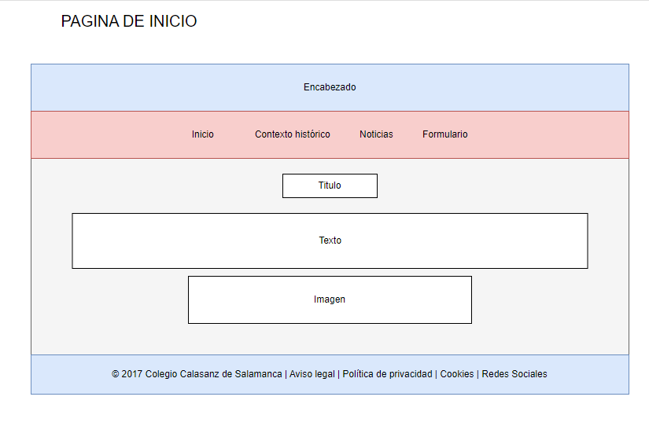

# Guia de estilo

- Seleccion de tipografia 
    - Titulo / Encabezado: Cinzel-Bold
    - Menu desplegable: Quicksand_Book
    - Subtitulos: CaviarDreams_Bold
    - Texto: Roboto-Light
    - Detalles: Lettertype Mies Christmas Icons / Merry Christmas Trees 

- Seleccion de colores
    - Azul oscuro:  #1D3557 o #0B3D91
    - Dorado o Amarillo Suave:  #F1C40F o un amarillo claro. 
        - Usarlos en detalles, íconos, o incluso en títulos y subtítulos.
    - Rojo Vino o Borgoña: #8B0000 o #B22222. 
        - Uso en botones, enlaces o como fondo para elementos destacados.
    - Verde Oscuro: #2C5F2D o #1F4D2E. 
        - Para barras laterales, bordes o íconos decorativos
    - Blanco o Gris Claro: #F5F5F5 o #EAEAEA 

- Resumen organizacion de los colores
    - Encabezado principal: Fondo azul oscuro con el título en dorado o blanco.
    - Subtítulos: Rojo vino o dorado para diferenciar las secciones.
    - Botones: Fondo rojo vino con texto en blanco para hacerlos destacables y acordes a la temporada.

## Esquemas de las paginas

- Pagina principal

- Pagina contexto historico

- Pagina contexto historico: que es la navidad

- Pagina contexto historico: la navida en el colegio

- Pagina noticia

- Pagina formulario
